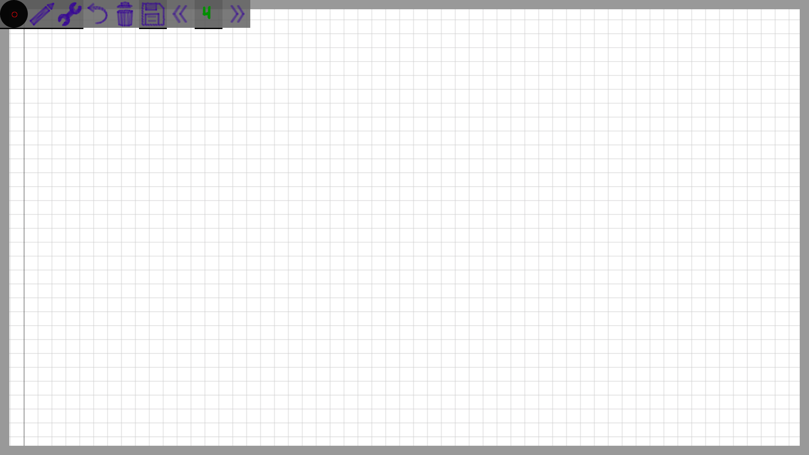

# chalkboard

Mobile touch friendly lightweight chalkboard.
Should work just fine in both desktop and mobile Chrome..

## functionality:

* basic figures available: lines, arrows, boxes, ellipses..
* drawing modes: solid, dashed, dotted, "distorted" (supposed to mimic real world whiteboard drawings)
* basic text typing (latin alphanumeric, all glyphs vector-rendered as you type them)
* selecting, copypasting (works with system clipboard)
* basic presenting: slides / viewpoint list handling and navigation
* virtually infinite zoom
* rudimentary online shared drawing sessions (refreshed with server polling, so not instant, available only with backend enabled)
* supports stylus / pen input instruments (e.g. drawing tablets), translating pressure into opacity and pen width
* working with rasterized images (pictures could be pasted from clipboard, or dragged onto the board)
* named boards
* read-only (write protected) boards
* saving / loading board from / to browser local storage
* downloading / uploading board from / to machine local storage (json serialised)
* downloading board as png
* viewpoint lead / follow (tethering) mode for shared sessions
* session record / play mode (with backend also supports record save and load operations)
* whiteboard (bright) / blackboard (dark) / greenboard themes

### hosted on github pages:

 * https://r0d1on.github.io/chalkboard/

### running locally:

**you'll need to have docker installed.**

* `make run` (if you have **make**) 

**or**

* `docker build -t chalkboard .` 
* `docker run -p 5000:5000 chalkboard`.
* navigate to *http://127.0.0.1:5000*

